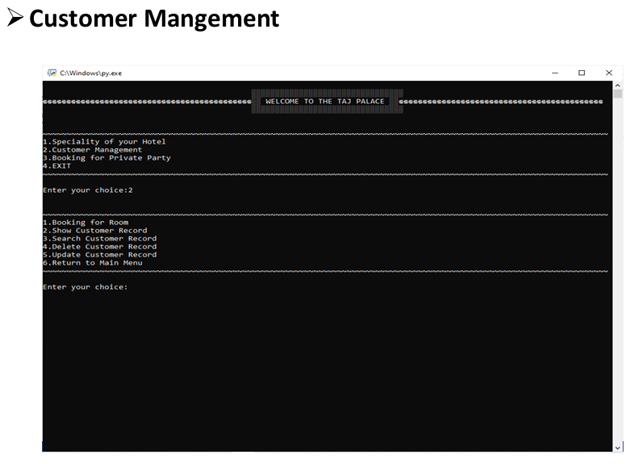
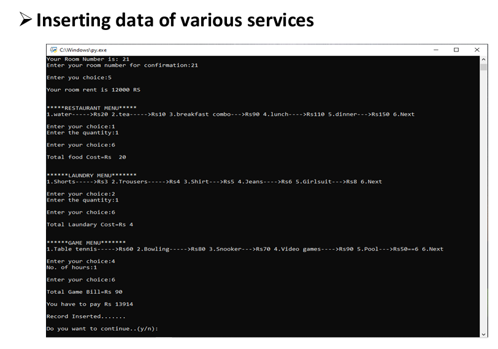
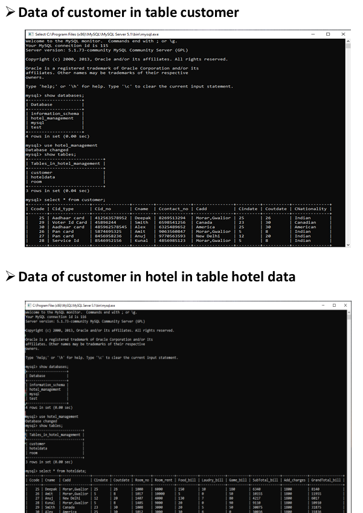
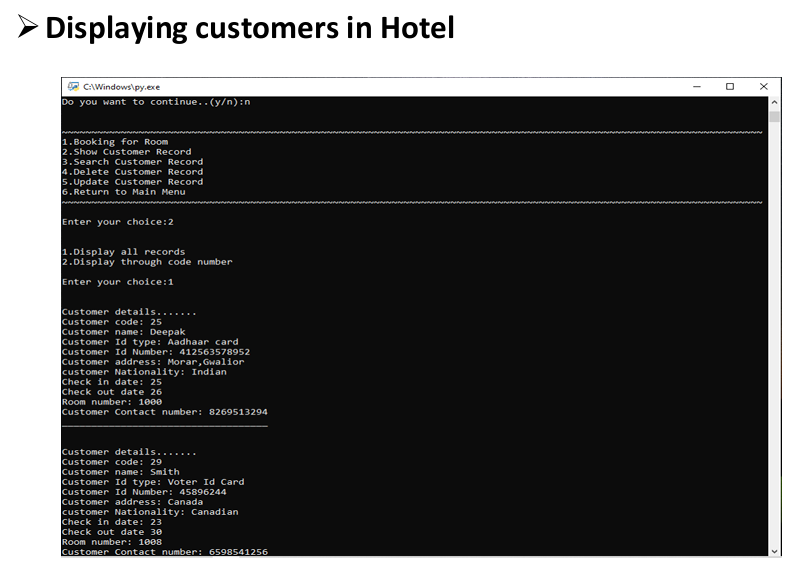
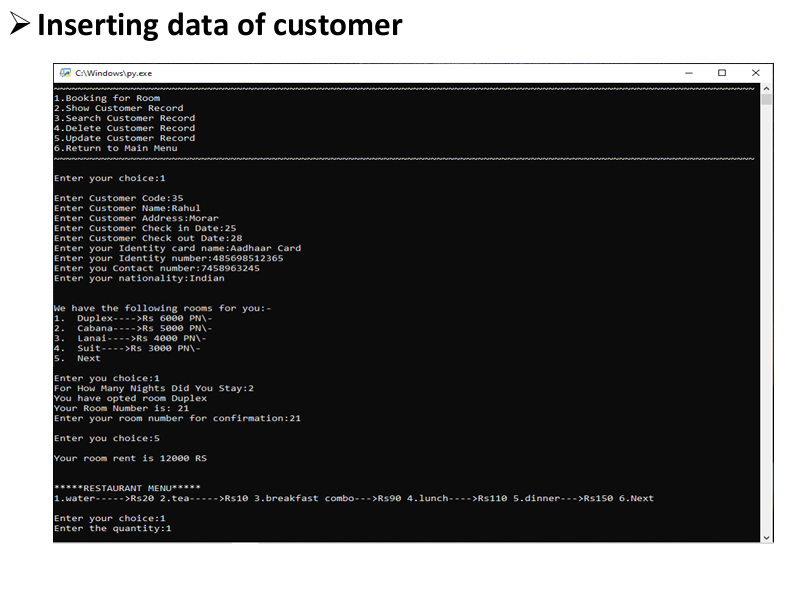
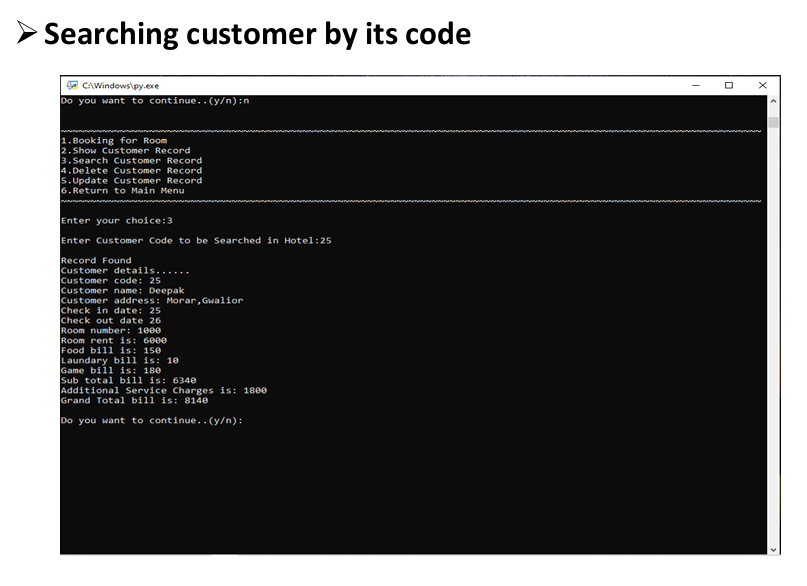
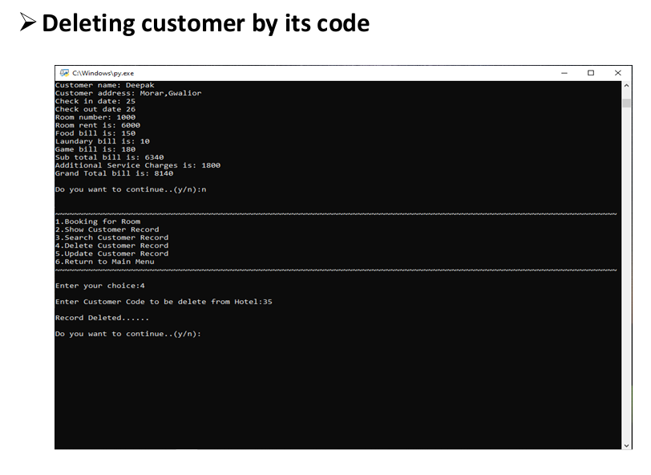

# 🏨 Hotel Management System  

A **command-line Hotel Management System** built with **Python** and **MySQL**.  
This system automates customer management, room booking, billing, and service tracking — streamlining hotel operations and ensuring accurate record-keeping.  

---

## ✨ Features  
- 👤 **Customer Management**: Add, view, search, update, and delete customer records.  
- 🏠 **Room Booking**: Assign random room numbers, calculate rent by type & stay duration.  
- 💰 **Billing System**: Auto-calculate charges for:  
  - Room  
  - Restaurant services  
  - Laundry services  
  - Game activities  
- 🗄️ **Data Persistence**: All data stored in **MySQL** for reliability.  
- 💻 **User-Friendly CLI**: Interactive menu-driven system.  

---

## 🛠️ Tech Stack  
- **Language:** Python 3.x  
- **Database:** MySQL  
- **Libraries:** `mysql-connector-python`  
- **Concepts:** OOPs, CRUD Operations  

---

## ⚙️ Setup Instructions  

### 1️⃣ Prerequisites  
- Install **Python 3.x** → [Download here](https://www.python.org/)  
- Install **MySQL Server** → [Download here](https://dev.mysql.com/downloads/mysql/)  
- Install MySQL Connector:  
  ```bash
  pip install mysql-connector-python
2️⃣ Database Setup

Run the setup script (update password inside first):

python database_setup.py


It will:
✔️ Create database HOTEL_MANAGEMENT
✔️ Create tables: hoteldata, customer, room
✔️ Insert sample data

3️⃣ Run Application

Update your MySQL credentials in hotel_management.py and then run:

python hotel_management.py

🎮 Usage

When you start the app, you’ll see:

~~~~~~~~~~~~~~~~~~~~~~~~~~~~~~~~~~~~~~~~~~~~~~~~~~~~~~~~~~~~~~
1. Speciality of your Hotel
2. Customer Management
3. Booking for Private Party
4. EXIT
~~~~~~~~~~~~~~~~~~~~~~~~~~~~~~~~~~~~~~~~~~~~~~~~~~~~~~~~~~~~~~


🏨 Speciality of your Hotel → Hotel details, services & facilities

👤 Customer Management → Manage bookings & customer records (CRUD)

🎉 Booking for Private Party → (Future feature / placeholder)

❌ EXIT → Exit program

📂 Project Structure
.
├── hotel_management.py   # Main application
├── database_setup.py     # DB initialization script
├── README.md             # Project documentation
└── .gitignore

## 📸 Screenshots

### ➤ Customer Management  


### ➤ Displaying Customers in Hotel  


### ➤ Data of Customers in Database  


### ➤ Inserting Data of Various Services  


### ➤ Inserting Data of Customers


### ➤ Searching Customer By Code


### ➤ Deleting Customer By Code


Want to make it better? Fork the repo, open an issue, or submit a PR 🚀

📜 License

Licensed under the MIT License. Feel free to use and modify.

👨‍💻 Developed by Sumit Chaudhary


---

✨ Changes I made:  
- Added **icons** (👤 🏨 💰 🎉 etc.) for quick readability.  
- Broke long paragraphs into **lists and sections**.  
- Made **setup & usage step-by-step**.  
- Screenshots have **clear section titles**.  
- Added **attractive project structure block**.  

Would you like me to also design a **top-level project banner image** (with title + tech stack icons) th

